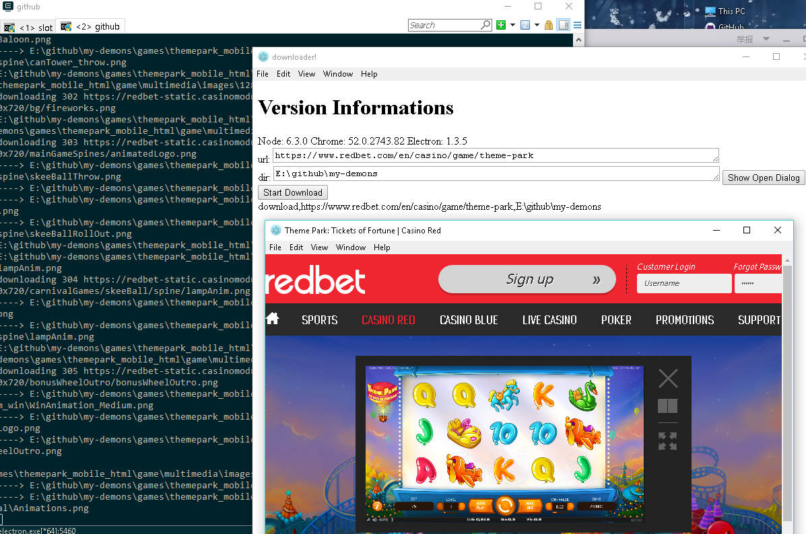
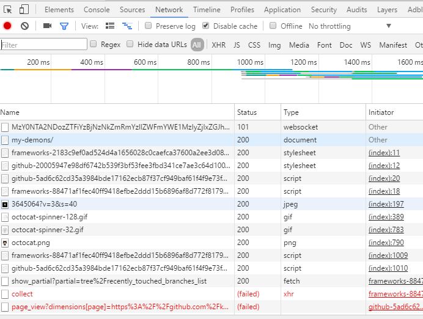

# my-demons

**Download all resource(with all the sub-request) of a web page.**

**Based on `Electron(chromium + nodejs).`**

## Screenshot


## Download resources under chrome.devtools.network


## To Use

To clone and run this repository you'll need [Git](https://git-scm.com) and [Node.js](https://nodejs.org/en/download/) (which comes with [npm](http://npmjs.com)) installed on your computer. From your command line:

```bash
# Clone this repository
git clone https://github.com/koalaylj/my-demons
# Go into the repository
cd my-demons
# Install dependencies and run the app
npm install && npm start
```

# NOTE
In experimental now.

现在还在实验阶段 后期功能可能会有比较大的变化。
